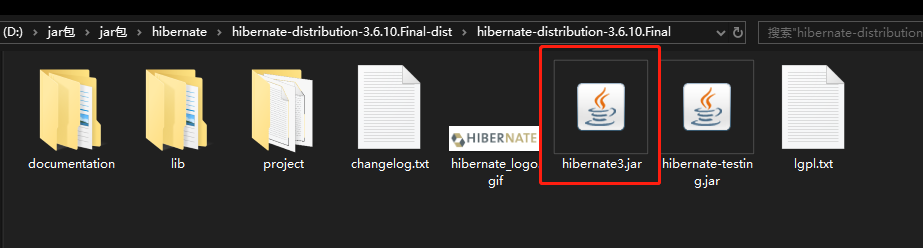
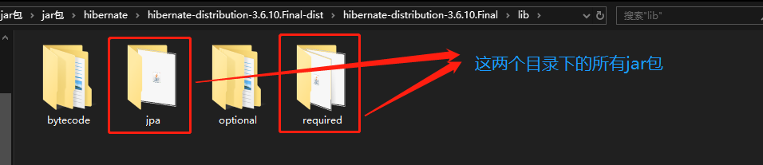
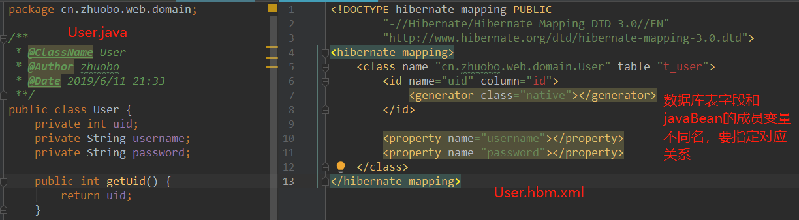
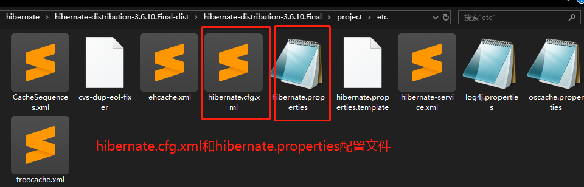

## 一、HIbernate框架介绍

Hibernate是一种**ORM**框架，用于在java对象和关系型数据库之间建立映射，以实现直接存取java对象，以面向对象的方法操作数据库，自动生成SQL语句，简化开发。

**ORM**：Object Relational Mapping，对象关系映射，用于实现面向对象编程语言里不同类型系统数据之间的转换，简单来说就是对象和数据库表之间通过映射关系联系起来，一个对象对应一张数据库表。

## 二、Hibernate的使用

### 1. 导入jar包





### 2. HIbernate的核心配置文件

将`project/etc`下的 `hibernate.cfg.xml`配置文件拷贝到`src`目录下，并配置如下内容：

```xml
<!DOCTYPE hibernate-configuration PUBLIC
	"-//Hibernate/Hibernate Configuration DTD 3.0//EN"
	"http://www.hibernate.org/dtd/hibernate-configuration-3.0.dtd">

<hibernate-configuration>
	<session-factory>
		<!-- 1、配置数据库连接的4个参数 -->
		<property name="hibernate.connection.driver_class">com.mysql.jdbc.Driver</property>
		<property name="hibernate.connection.url">jdbc:mysql:///hibernate</property>
		<property name="hibernate.connection.username">root</property>
		<property name="hibernate.connection.password">root</property>
		
		<!--  是否显示sql语句 -->
		<property name="show_sql">true</property>
		<!--  是否格式化sql语句 -->
		<property name="format_sql">true</property>
<!--  是否自动提交事务 -->
		<property name="hibernate.connection.autocommit">true</property>
		
		<!-- 2、配置JavaBean与表的映射文件 -->
		<mapping resource="com/gyf/hibernate/domain/User.hbm.xml"/>
	</session-factory>
</hibernate-configuration>
```

### 3. 编写javaBean与映射文件javaBean.hbm.xml

### 

**注意：**

1. XXX.hbm.xml里的xxx与javabean同名，比如模型为User，那么映射文件应该命名为User.hbm.xml，并且放置在同一个包里面，比如都是放在domain包下；
2. 映射文件里，如果javabean的成员变量与数据库表字段不一致，要指定`column`

### 4. 测试

```java
public class Test01 {
    @Test
    public void test1() {
        //1.获取核心 配置文件对象,默认是加载src的hibernate.cfg.xm文件
        Configuration cfg = new Configuration().configure();

        //2.创建会话工厂
        SessionFactory factory = cfg.buildSessionFactory();

        //3.创建会话
        Session session = factory.openSession();
        //开启事务
        Transaction trans = session.beginTransaction();

        //保存
        User user = new User();
        user.setUsername("zhuobo");
        user.setPassword("abcdefg");
        session.save(user);

        //提交事务
        trans.commit();
        //4.关闭会话
        session.close();
        //5.关闭工厂，释放资源
        factory.close();
    }
}
```

## 三、Hibernate的一些API

### 1. Configuration配置对象

一般来说Hibernate可是使用两种核心配置文件的格式，一种是`xml`格式、另一种是`properties`格式，这两个配置文件都是放在`project/etc`目录下。由于`properties`格式的文件是键值对的形式，有键名必须唯一的局限性，一般来说xml配置文件更加常用，可以配置更多的内容。



在上面的测试中，要先获取`Configuration`配置对象，事实上就是在加载配置文件：

```java
//1.获取核心 配置文件对象,默认是加载src的hibernate.cfg.xm文件
//调用configure()方法加载的是hibernate.cfg.xml文件
//直接new Configuration()加载的是hibernate.properties文件
// 默认情况下，配置文件都是放在src目录先
Configuration cfg = new Configuration().configure();
```

**加载映射文件**：

1. 在hibernate.cfg.xml中配置，这是最常用的方法：

```java
<!-- 2、配置JavaBean与表的映射文件 -->
<mapping resource="com/gyf/hibernate/domain/User.hbm.xml"/>
```

2. 配置文件对象`Configuration`调用方法`addResource()`:

```java
//1.获取核心 配置文件对象,默认是加载src的hibernate.cfg.xm文件
Configuration cfg = new Configuration().configure(); 
cfg.addResource("cn\\zhuobo\\web\\domain\\User.hbm.xml");
```

3. 配置文件对象`Configuration`调用方法`addClass()`:

```java
//1.获取核心 配置文件对象,默认是加载src的hibernate.cfg.xm文件
Configuration cfg = new Configuration().configure();
cfg.addClass(User.class);
```

这三种方法，第一种在核心配置文件hibernate.cfg.xml中配置映射文件时最常使用的方法。

### 2. SessionFactory

SessionFactory是生产session的工厂，就相当于数据库连接池，管理数据库连接。要注意的是SessionFactory不是轻量级的，一般来说一个项目只需要一个SessionFactory就可以了，用来负责管理应用程序和数据库的所有会话（session），**SessionFactory是线程安全的**。获取`SessionFactory`的方法是`Configuration`配置对象调用方法`buildSessionFactory()`:

```java
//1.获取核心 配置文件对象,默认是加载src的hibernate.cfg.xm文件
Configuration cfg = new Configuration().configure(); 
//2.创建会话工厂
SessionFactory factory = cfg.buildSessionFactory();
```


### 3. Session

Hibernate中的Session与HttpSession的概念有点不一样，HttpSession表示用户与服务器的一次会话，Hibernate的Session表示应用程序与数据库的一次会话（交互）。session是轻量级的，线程不安全的，通常将一个session和一个数据库事务绑定，每次执行一个数据库事务都要创建一个session（从SessionFactory中获取一个session），使用session后还有关闭session（归还session）。

SessionFactory提供了两个方法来获取Session：

1. factory.openSession()：获取一个全新的Session；

2. factory.getCurrentSession()：获取与当前线程绑定的Session，一个线程只有一个Session。

   

