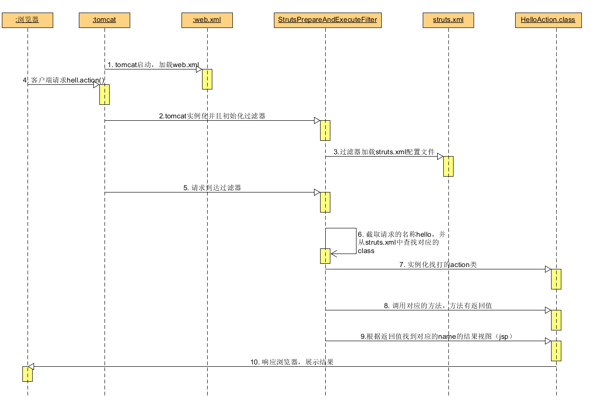
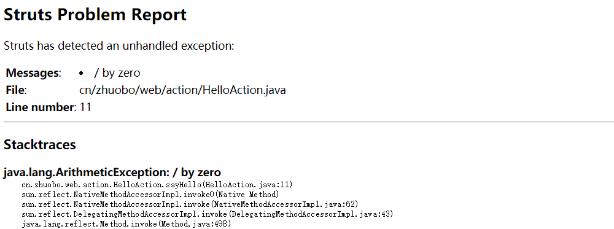
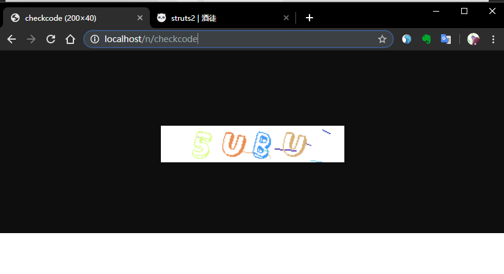
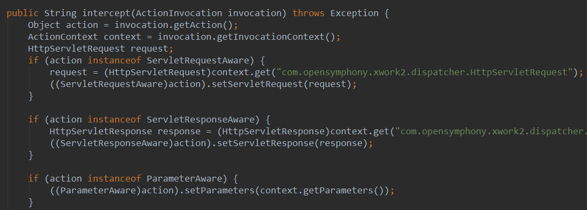
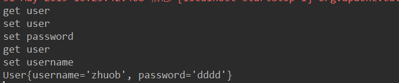

## 一、介绍

Struts2是Apache发行MVC开源框架，也就是表现层框架。MVC包括：

M：Model，用于封装数据，javabean

V：View，用于展示数据，jsp

C：Controller，控制程序的流程，servlet、filter

## 二、使用

1. 创建一个javaweb项目，导入Struts2的相关jar包

2. 配置web.xml

   ```xml
   <?xml version="1.0" encoding="UTF-8"?>
   <web-app xmlns="http://xmlns.jcp.org/xml/ns/javaee"
            xmlns:xsi="http://www.w3.org/2001/XMLSchema-instance"
            xsi:schemaLocation="http://xmlns.jcp.org/xml/ns/javaee http://xmlns.jcp.org/xml/ns/javaee/web-app_4_0.xsd"
            version="4.0">
   	<!-- 配置一个拦截器 -->
       <filter>
           <filter-name>struts2</filter-name>
           <filter-class>org.apache.struts2.dispatcher.ng.filter.StrutsPrepareAndExecuteFilter</filter-class>
       </filter>
   
       <!-- 该strut过滤器拦截所有的请求 -->
       <filter-mapping>
           <filter-name>struts2</filter-name>
           <url-pattern>/*</url-pattern>
       </filter-mapping>
   </web-app>
   ```

3. 在src目录下创建 `struts.xml`,配置如下

   ```xml
   <?xml version="1.0" encoding="UTF-8" ?>
   <!DOCTYPE struts PUBLIC
      "-//Apache Software Foundation//DTD Struts Configuration 2.3//EN"
      "http://struts.apache.org/dtds/struts-2.3.dtd">
   
   <struts>
   <!-- package表示包
           name：包名
           extends：继承，默认是struts-default
       action:动作
           name：相当于servlet的映射路径
           class：处理请求的类,相当于一个servlet
           method：处理请求的方法
       result：结果，写返回的jsp页面
   -->
   <package name="p1" extends="struts-default">
      <action name="hello" class="cn.zhuobo.web.action.HelloAction" method="sayHello">
         <result name="success">/success.jsp</result>
      </action>
   </package>
   
   </struts>
   ```

4. 编写一个类，用于处理请求（相当于servlet），类里编写一个方法，返回一个String

   ```java
   package cn.zhuobo.web.action;
   
   public class HelloAction {
       public String sayHello() {
           System.out.println("Hello action 调用");
           return "success";
       }
   }
   ```

5. 新建一个jsp页面

   ```html
   <body>
   由helloaction返回的jsp页面
   </body>
   ```

6. 访问hello：http://localhost/hello

## 三、处理的过程

1. 浏览器请求资源`hello`，服务器收到请求

2. 在 `struts.xml`匹配 `name='hello'`的标签，由此将请求交给对应的class、class里的method处理

3. 根据method指定的方法返回的字符串 “success” 找到对应name为success的result标签，将success.jsp转为静态页面响应回客户端

4. struts流程图：


5. struts架构图，解释了struts处理请求的过程


## 四、struts配置文件加载的顺序

1. 加载顺序

| 顺 序 | 配置文件名         | 所在位置                                     | 说明                             |
| :---- | ------------------ | -------------------------------------------- | -------------------------------- |
| 1     | default.properties | struts2-core-2.3.15.3.jar\org\apache\struts2 | 不能修改                         |
| 2     | struts-default.xml | struts2-core-2.3.15.3.jar                    | 不能修改                         |
| 3     | strtuts-plugin.xml | 在struts2提供的插件jar包中                   | 不能修改                         |
| 4     | struts.xml         | 我们的应用中                                 | 可以修改的：推荐                 |
| 5     | struts.properties  | 我们的应用中                                 | 可以修改的                       |
| 6     | web.xml            | 我们的应用中                                 | 可以修改的，可以给过滤器配置参数 |

后加载的配置文件可以覆盖前面的配置文件；

2. default.properties的一些默认的配置信息

| 配置                             | 作用                                                       |
| :------------------------------- | ---------------------------------------------------------- |
| struts.i18n.encoding=UTF-8       | 使用编码集为UTF-8                                          |
| struts.action.extension=action,, | 默认访问的扩展后缀为.action或者空（没有后缀）              |
| struts.devMode = false           | 开发者模式默认关闭，设置为true在出错的时候可以显示更加详细 |

3. 修改访问后缀的三种方式，要注意的是以下一旦配置了就会覆盖default.properties的后缀action或者空后缀

   1. 方法1：在struts.xml中配置

      `<constant name="struts.action.extension" value="do"></constant>`

   2. 方法2：在src下创建配置文件，名为struts.properties，文件内容为 `struts.action.extension=do`

   3. 方法3：在web.xml中配置如下，后缀为ddd

      ```xml
      <filter>
          <filter-name>struts2</filter-name>
          <filter-class>org.apache.struts2.dispatcher.ng.filter.StrutsPrepareAndExecuteFilter</filter-class>
      
          <init-param>
              <param-name>struts.action.extension</param-name>
              <param-value>ddd</param-value>
          </init-param>
      </filter>
      ```
      

4. 配置为开发模式：在struts.xml中配置一个常量，显示更为详细的错误新仙尼

   `<constant name="struts.devMode" value="true"></constant>`



## 五、struts.xml配置文件的元素

### 1. package元素，表示包，相关属性如下	

|   属性    | 作用                                                         |
| :-------: | ------------------------------------------------------------ |
|   name    | 包名，必须的属性，并且是在struts配置中包名要唯一             |
|  extends  | 继承，表示继承的包，一般都要继承 `struts-default`，该包邮转发、重定向等功能，继承这个包可以使用struts的核心功能 |
| abstract  | 抽象，值为true表示这个包是抽象的，可以用来被其他的包继承，只要这个包没有action元素都可以被声明为抽象的 |
| namespace | 命名空间，访问路径 = 命名空间 + 动作名                       |

### 2. namespace的查找规则

namespace的默认值是一个空字符串，如果配置的值为 `/user`（注意要加/斜杠），那么访问路径就是 `user/helloAcion.do`

```xml
<package name="p1" extends="struts-default" namespace="/user">
   <action name="hello" class="cn.zhuobo.web.action.HelloAction" method="sayHello">
      <result name="success">/success.jsp</result>
   </action>
</package>
```

如果访问的是：http://localhost:8080/demo1/a/b/user/hello.action

1. 首先查找是否还有package的namespace为 /a/b/user
2. 如果有，就访问这个包里的对应的hello.action
3. 如果没有，就查找是否有namespace为 /a/b的包，依次类推

因此如果有一个package的namespace值为 `/user`，(如上面的配置)，那么http://localhost:8080/demo1/a/b/user/hello.action是不可以访问到hello.action的，但是http://localhost:8080/demo1/user/a/b/hello.action是可以访问到hello.action的，因为最后会查找到是否有 /user 这个命名空间，然后访问该包下的action。


### 3. action元素，用于配置动作，处理请求路径，属性如下：

|  属性  | 作用                                              |
| :----: | ------------------------------------------------- |
|  name  | 动作名，相当于servlet的映射路径                   |
| class  | 动作类的全类名，是处理请求的类，相当于一个servlet |
| method | 动作类里处理请求的方法                            |

   动作类有3中写法：

- 第一种写法：直接写一个action类，然后再struts.xml里配置

  ```java
  public class HelloAction1 {
      public String sayHello() {
          System.out.println("Hello action 调用");
          return "success";
      }
  }
  ```

  ```xml
  <package name="p1" extends="struts-default" namespace="/user1">
     <action name="hello" class="cn.zhuobo.web.action.HelloAction1" method="sayHello">
        <result name="success">/success.jsp</result>
     </action>
  </package>
  ```

- 第二种写法：写一个action类，实现Action接口，overridee execute方法，在struts配置action元素时，不用指定method，因为默认就是执行动作类的execute方法

  ```java
  public class HelloAction2 implements Action {
      @Override
      public String execute() throws Exception {
          return SUCCESS;
      }
  }
  ```

    struts.xml

  ```xml
  <package name="p2" extends="struts-default" namespace="/user2">
     <action name="hello" class="cn.zhuobo.web.action.HelloAction2">
        <result name="success">/success.jsp</result>
     </action>
  </package>
  ```

- 第三种写法：写一个action类，继承ActionSupport类（ActionSupport类是实现了Action的类）

  ```java
  import com.opensymphony.xwork2.ActionSupport;
  
  public class HelloAction3 extends ActionSupport {
      public String login(){
          return SUCCESS;
      }
  }
  ```

  struts.xml

  ```xml
  <package name="p3" extends="struts-default" namespace="/user3">
     <action name="hello" class="cn.zhuobo.web.action.HelloAction3" method="login">
        <result name="success">/success.jsp</result>
     </action>
  </package>
  ```

**默认的动作类：**就是当配置了一个action元素，但是没有指定class，也没有指定method，那么就会默认找ActionSupport类去处理这个请求。由于由于struts.xml是在struts-default.xml后加载的，因此默认的动作类是可以修改，可以修改成自己写的类。

在package元素下配置一个default-class-ref，class指定自己的动作类。

```xml
<default-class-ref class="cn.zhuobo.web.action.HelloAction1"></default-class-ref>
```

**动作访问的通配符：**

1. 当实现用户的增删改查的时候，可以在一个UserAction里写add、delete、update、find的方法分别实现，这个时候的动作类可以是类似以下的类的定义：

   ```java
   public class UserAction extends ActionSupport {
       // 添加用户
       public String add(){
           return SUCCESS;
       }
       // 删除用户
       public String delete(){
           return SUCCESS;
       }
       // 更新用户
       public String update(){
           return SUCCESS;
       }
       // 查询用户
       public String find(){
           return SUCCESS;
       }
   }
   ```

   但是，当配置struts.xml的时候就会发现配置比较麻烦，对于这几个功能的配置应该如下。可以看出来要为每一个功能配置一个action元素，而且很多重复性的工作，比如每一个action都是同一个class，name、method、xxx.jsp其实都是同名的。

   ```xml
   <package name="userPackage" extends="struts-default" namespace="/user">
      <!-- 添加用户的动作 -->
      <action name="add" class="cn.zhuobo.web.action.UserAction" method="add">
         <result name="success">/add.jsp</result>
      </action>
   	<!-- 删除用户的动作 -->
      <action name="delete" class="cn.zhuobo.web.action.UserAction" method="delete">
         <result name="success">/delete.jsp</result>
      </action>
   	<!-- 更新用户的动作 -->
      <action name="update" class="cn.zhuobo.web.action.UserAction" method="update">
         <result name="success">/update.jsp</result>
      </action>
   	<!-- 查询用户的动作 -->
      <action name="find" class="cn.zhuobo.web.action.UserAction" method="find">
         <result name="success">/find.jsp</result>
      </action>
   </package>
   ```

   可以使用通配符是简化这种配置，使用通配符后配置应该如下：

   {1}：代表这是第一个通配符*

   ```xml
   <package name="userPackage" extends="struts-default" namespace="/user">
      <action name="*" class="cn.zhuobo.web.action.UserAction" method="{1}">
         <result name="success">/{1}.jsp</result>
      </action>
   </package>
   ```

   如果是定义了一个动作类如下，可以使用两个通配符*：

   ```java
   public class StudentAction extends ActionSupport {
       // add student
       public String addStudent() {
           return SUCCESS;
       }
   
       // delete student
       public String deleteStudent() {
           return SUCCESS;
       }
   }
   ```

   struts.xml

   ```xml
   <package name="studentPackage" extends="struts-default" namespace="/student">
      <action name="*_*" class="cn.zhuobo.web.action.StudentAction" method="{1}{2}">
         <result name="success">/{2}/{1}.jsp</result>
      </action>
   </package>
   ```

   当访问 http://localhost/student/add_Student，便可以执行响应的动作类的方法。 

2. 使用绝对的匹配和通配符的方法匹配，当两种方法都使用的时候，绝对匹配的优先，通配符的方法，根据在配置文件的位置顺序优先。


### 4. result元素

作用：为动作指定结果视图

属性：name、type

name：逻辑视图的名称，对应着动作的方法的返回值，默认是 `success`

type：结果类型，指的是用什么方法跳转到指定的页面，默认是 `dispatcher`

**type的取值：**

|    type取值    | 作用                                               |
| :------------: | -------------------------------------------------- |
|   dispatcher   | 默认值，使用请求转发，转发到一个页面               |
|    redirect    | 使用重定向，转向一个页面                           |
|     chain      | 转发到另一个action，可以是同一个包或者是不同一个包 |
| redirectAction | 重定向到另一个action，可以是同一个包或者不同一个包 |

dispatcher和redirect是用于对页面的请求转发和重定向的，而chain和redirectAction是用于对action的请求转发和重定向的。下面是配置的方法：

1. dispatcher、redirect

   ```xml
   <!-- 默认是dispatcher -->
   <action name="*_*" class="cn.zhuobo.web.action.StudentAction" method="{1}{2}">
   	<result name="success">/{2}/{1}.jsp</result>
   </action>
   
   <!-- redirect-->
   <action name="*_*" class="cn.zhuobo.web.action.StudentAction" method="{1}{2}">
   	<result name="success" type="redirect">/{2}/{1}.jsp</result>
   </action>
   ```

2. chain、redirectAction

   ```xml
   <!-- 转发或者重定向到同一个包的action -->
   <package name="userPackage" extends="struts-default" namespace="/user">
      <action name="*" class="cn.zhuobo.web.action.UserAction" method="{1}">
         <result name="success" type="chain">action2</result>
      </action>
   </package>
   
   <!-- 转发或者重定向到另一个包的action，需要添加参数param元素 -->
   <package name="userPackage" extends="struts-default" namespace="/user">
      <action name="*" class="cn.zhuobo.web.action.UserAction" method="{1}">
         <result name="success" type="chain">
            <param name="namespace">/student</param>
            <param name="actionName">{1}_Student</param>
         </result>
      </action>
   </package>
   ```

### 5. 自定义一个结果视图（result的type类型）

结果类型就是一个类，这些结果类型的类都是实现了 `com.opensymphony.xwork2.Result`接口，或者是继承了这个接口的实现类 `org.apache.struts2.dispatcher.StrutsResultSupport`。这些类都有一个 `doExecute`方法，用于执行结果视图。struts的内部本质上就是一个servlet，因此可以自定义一个结果视图，只要提供实现 `Result`接口，复写doExecute方法即可。下面举一个用于输出验证码的结果类型的例子：

1. 定义一个类 `CAPTCHAResult`类，继承 `StrutsResultSupport`类，在类里面覆盖重写 `doExecute`方法，该方法的逻辑就是生成验证码 --> 写回验证码到客户端

   ```java
   public class CAPTCHAResult extends StrutsResultSupport {
       private int width;
       private int height;
   	// 这里提供width和height的getter和setter方法，用于给struts注入参数
       @Override
       protected void doExecute(String s, ActionInvocation actionInvocation) throws Exception {
           // 1. 创建一个验证码，高度、验证码个数、线条数
           ValidateCode code = new ValidateCode(width, height, 4, 8);
   
           // 2. 获取response对象
           HttpServletResponse response = ServletActionContext.getResponse();
   
           // 3. 写回给客户端
           code.write(response.getOutputStream());
       }
   }
   ```

   `ValidateCode`是一个生成验证码的小框架。

2. 配置`struts.xml`文件

   ```xml
   <!-- 在这个包里声明一个验证码的结果类型-->
   <package name="p" extends="struts-default" namespace="/n">
       <!-- 在这里声明了一个局部的结果视图，就仅仅可在这个包里使用-->
       <result-types>
        <result-type name="captcha" class="cn.zhuob.web.result.CAPTCHAResult"></result-type>
       </result-types>
   
       <action name="checkcode">
           <result name="success" type="captcha">
               <!--使用param元素为结果类注入参数-->
               <param name="width">200</param> 
               <param name="height">40</param>
           </result>
       </action>
   </package>
   ```

   result元素里的param子元素：如果在动作类中有与param的name相同的属性，struts会自动请求参数并将参数值通过setter方法设置到类的同名属性中。

3. 展示：访问 http://localhost/n/checkcode

   

### 6.  局部结果视图和全局的结果视图

按照前面定义的结果视图，是一个局部视图，只能在包内访问，在另一个包是不能访问的。要使不同的包都可以访问同一个视图，那么就要定义为全局视图。参考抽取一个`BaseServlet`，在`BaseServlet`的`service`方法里完成方法的分发，让其他的`servlet`继承`BaseServlet`的方法。这里也可以定义一个抽象的包，在这个抽象的包里定义一个结果视图，其他的包继承这个抽象包便都可以访问这个结果视图。

抽象包：没有action元素，用来继承

```xml
<package name="myDefault" extends="struts-default" abstract="true">
    <result-types>
        <result-type name="captcha" class="cn.zhuob.web.result.CAPTCHAResult"></result-type>
    </result-types>

    <global-results>
        <result name="success" type="captcha">
            <param name="width">500</param>
            <param name="height">100</param>
        </result>
    </global-results>
</package>
```

要访问全局视图的包：继承包myDefault

```xml
<package name="p" extends="myDefault" namespace="/n">
   <action name="checkcode"></action>
</package>
```

## 六、获取Servlet的request、response等对象

### 1. 通过ServletActionContext类获取

```java
public class TestAction extends ActionSupport {
    public String test() {
        // 获取request、response、session、application

        // 1. 通过ServletActionContext获取
        HttpServletRequest request = ServletActionContext.getRequest();
        // StrutsRequestWrapper --> 属于struts，是HttpServletRequest的实现类

        HttpServletResponse response = ServletActionContext.getResponse();
        // ResponseFacade --> 属于tomcat，是HttpServletResponse的实现类

        HttpSession session = request.getSession();
        // StandardSessionFacade --> 属于tomcat，是HttpSession的实现类

        ServletContext application = ServletActionContext.getServletContext();
        // ApplicationContextFacade --> 属于tomcat
        return NONE;
    }
}
```

### 2. 通过注入的方法，要实现XXXAware接口

```java
public class TestAction extends ActionSupport
        implements ServletRequestAware, ServletResponseAware, ServletContextAware {

    private HttpServletResponse response;
    private HttpServletRequest request;
    private ServletContext application;

    public String test() {
        System.out.println(request);
        System.out.println(response);
        System.out.println(application);

        return NONE;
    }

    @Override
    public void setServletRequest(HttpServletRequest httpServletRequest) {
        this.request = httpServletRequest;
        System.out.println("注入" + this.request);
    }

    @Override
    public void setServletResponse(HttpServletResponse httpServletResponse) {
        this.response = httpServletResponse;
        System.out.println("注入" + this.response);
    }

    @Override
    public void setServletContext(ServletContext servletContext) {
        this.application = servletContext;
        System.out.println("注入" + this.application);
    }
}
```

这种通过注入的方法是由struts的拦截器实现的。根据前面的struts结构图，要访问Action首先要经历一系列的拦截器（Interceptor），拦截器首先会对被访问的action对象作出一些处理。在这种获取方式里，`< interceptor name="servletConfig"class="org.apache.struts2.interceptor.ServletConfigInterceptor"/>`这个拦截器将调用上面的三个方法注入。查看 `ServletConfigInterceptor`的源码：



访问action前要先访问拦截器，`ServletConfigInterceptor`拦截器的主要作用是获取要被访问的action，然后判断是否实现了 `ServletRequestAware`、`ServletResponseAware`、`ServletContextAware`等接口，如果实现了获取相应的`HttpServletRequest`、`HttpServletResponse`、`ServletContext`，然后调用Action的setter方法注入。

## 七、多个struts.xml的配置

当开发的功能越来越多，应用的规模越来越复杂，随着action的增加，struts.xml不可避免的变得越来越臃肿，而且还不利于模块分工的开发。为了增加struts.xml的可读性、利于模块开发、减少冲突，可以将struts.xml分解为多个配置文件，典型的就是根据功能模块去划分。比如，当应用可以分为user、order、pay三个功能，都在同一个struts.xml中配置会是这种形式：

struts.xml

```xml
<!-- user模块-->
<package name="p1" extends="struts-default" namespace="/user">
   <action name=""></action>
</package>

<!-- order模块-->
<package name="p2" extends="struts-default" namespace="/order">
   <action name=""></action>
</package>

<!-- pay模块-->
<package name="p3" extends="struts-default" namespace="/pay">
   <action name=""></action>
</package>
```

当采取划分多个为多个配置文件的方式，只需要每个模块分别写自己的配置文件，在struts.xml中包含这些配置文件即可。

struts-user.xml

```xml
<!-- user模块-->
<package name="p1" extends="struts-default" namespace="/user">
   <action name=""></action>
</package>
```

struts-order.xml

```xml
<!-- order模块-->
<package name="p2" extends="struts-default" namespace="/order">
   <action name=""></action>
</package>
```

struts-pay.xml

```xml
<!-- pay模块-->
<package name="p3" extends="struts-default" namespace="/pay">
   <action name=""></action>
</package>
```

然后再struts.xml中包含以上3个xml

```xml
<include file="struts-user.xml"></include>
<include file="struts-order.xml"></include>
<include file="struts-pay.xml"></include>
```

## 八、Action接收请求参数

### 1. 通过servlet获取，先获取request对象

```java
public class LoginAction extends ActionSupport {
    public String login() {
        HttpServletRequest request = ServletActionContext.getRequest();
        String username = request.getParameter("username");
        String password = request.getParameter("password");
        System.out.println(username);
        System.out.println(password);

        return NONE;
    }
}
```

### 2. 通过Action属性的setter方法注入

在访问action之前，拦截器先获取action，判断Action类是否有password和username属性，如果有就调用对应的setter方法为属性注入值。

```java
public class LoginAction extends ActionSupport {
    private String password;
    private String username;

    public void setPassword(String password) {
        System.out.println("set password");
        this.password = password;
    }

    public void setUsername(String username) {
        System.out.println("set username");
        this.username = username;
    }

    public String login() {
        System.out.println(username);
        System.out.println(password);

        return NONE;
    }
}
```

### 3. 通过Action属性的模型注入

其实也就是不分别注入username、password，Action类提供的是User成员变量，而User有username和password这两个成员变量。还是一样的过程，拦截器首先判断Action类是否有user这个属性，如果有就调用setUser方法注入参数。

提交的表单：注意name的值是user.username、user.password

```html
<form action="${pageContext.request.contextPath}/login.do">
    username:<input type="text" name="user.username">
    password:<input type="password" name="user.password">
    <input type="submit" value="登录">
</form>
```

LoginAction：提供setUser、getUser方法

```java
public class LoginAction extends ActionSupport {
    private User user;

    public void setUser(User user) {
        System.out.println("set user");
        this.user = user;
    }

    public User getUser() {
        System.out.println("get user");
        return this.user;
    }

    public String login() {
        System.out.println(user);
        return NONE;
    }
}
```

根据输出结果：getUser方法执行了2次，setter方法执行了1次，过程是：tomcat服务器创建Action实例，得到Action的具体信息，成员变量User、成员方法setter、getter，然后tomcat执行拦截器的内容，也就是判断是否有user这个属性，那么就调用setUser注入参数。过程如下：1. 首先调用getUser发现user为null；2. new 一个Use；3. 调用setUser设置user为new出来的user；3. 设置password；4. getUser，获取user去设置username	



### 4. Action的模型驱动封装参数

这个工作也是一个拦截器做了，这个拦截器叫模型驱动拦截器 `com.opensymphony.xwork2.interceptor.ModelDrivenInterceptor`，它不会创建模型，因此Action提供的模型属性要自己new出来赋值。

1. Action实现一个 `ModelDriven<User>`接口，覆盖重写 `getModel`方法；
2. Action提供一个模型属性，并且要赋值；
3. 这种方法，表单的name就不用写`user.`

Action:

```java
public class LoginAction extends ActionSupport implements ModelDriven<User> {
    private User user = new User();// user 要赋值！！

    public String login() {
        System.out.println(user);
        return NONE;
    }

    @Override
    public User getModel() {
        return user;
    }
}
```

表单：

```HTML
<form action="${pageContext.request.contextPath}/login.do">
    username:<input type="text" name="username">
    password:<input type="password" name="password">
    <input type="submit" value="登录">
</form>
```

