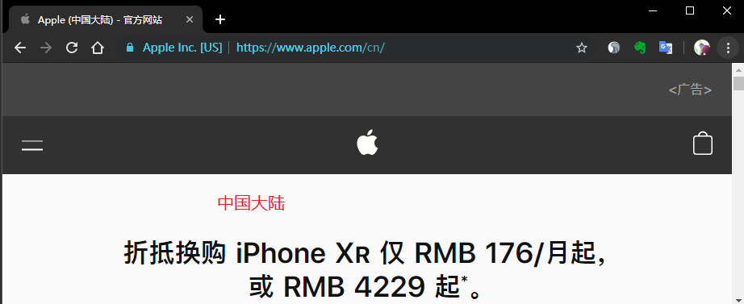
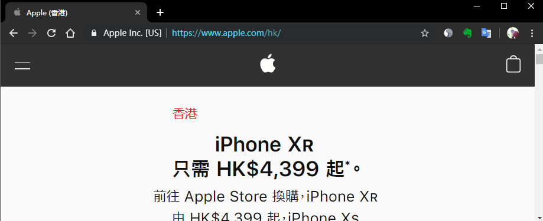
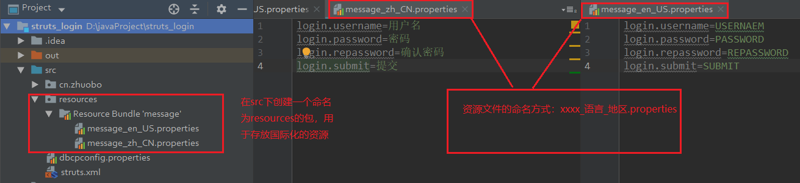
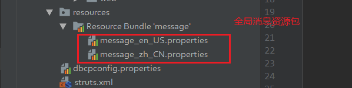
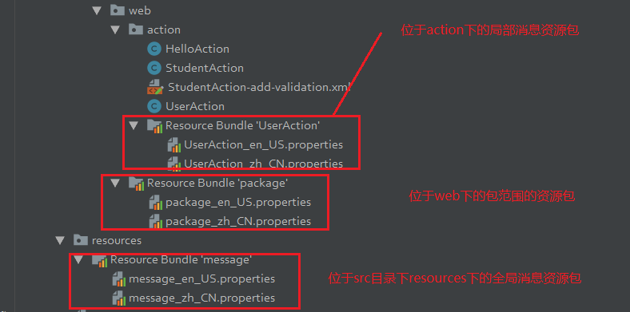
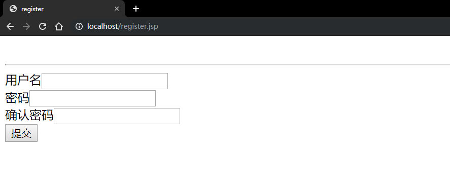
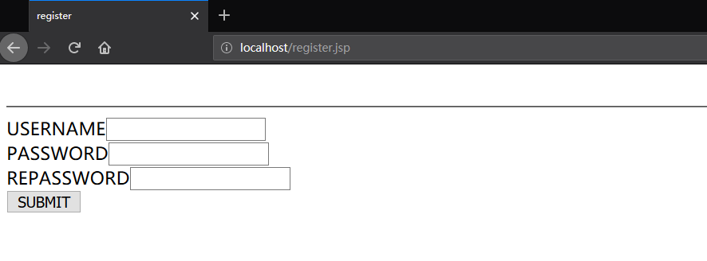

## 一、软件的国际化

为了使不同国家和地区的人可以使用到使用该地区的网站、应用，网站必须适配不同国家和地区的语言，而且还要使软件的开发与特定的语言脱钩。也就是说不能专门为了适配中文写一个软件、适配英文再写一个软件、适配繁体字也写一个软件，做到当软件在不通的国家和地区被使用就可以不必更改代码就可以适应该地区的语言。

苹果官网为不同的地区适配了不同的语言。






## 二、读取国际化数据

### 1. 创建国际化的资源数据

在`src`目录下创建`resources`资源目录，在`resources`目录里创建创建国际化资源数据，命名的方法为`xxx_语言_地区.properties`。比如可以创建中国大陆的国际化数据，资源文件名为`message_zh_CN.properties`，创建美国的国际化资源数据`message_en_US.properties`。资源文件的内容如下，就可以实现访问同一个注册页面，当用户在美国注册页面显示中文，在中国大陆注册显示简体中文。



### 2.  java中读取国际化的数据

```java
@Test
public void test1() {
    //读取国际化的资源数据
    // 使用ResourceBundle读取国际化的数据，这是读取默认的语言
    //ResourceBundle rb = ResourceBundle.getBundle("resources.message");

    //读取指定的地区的语言的数据
    //ResourceBundle rb = ResourceBundle.getBundle("resources.message", Locale.US);
    /*
    USERNAEM
    PASSWORD
    REPASSWORD
    SUBMIT
     */

    ResourceBundle rb = ResourceBundle.getBundle("resources.message", Locale.CHINA);
    /*
    用户名
    密码
    确认密码
    提交
     */

    System.out.println(rb.getString("login.username"));
    System.out.println(rb.getString("login.password"));
    System.out.println(rb.getString("login.repassword"));
    System.out.println(rb.getString("login.submit"));
}
```


### 3. 在jsp中读取国际化的数据

和java中类似的，只是中jsp标签之中写java代码，当然jsp本质上就是java。

### 4. 在jstl中读取国际化的数据	

## 三、struts国际化的实现步骤

### 1. 配置资源包

1. 配置全局的资源包

   在`src`目录下创建`resources`资源目录，在`resources`目录里创建创建国际化资源数据，命名的方法为`xxx_语言_地区.properties`。这种方法创建的资源包就是全局资源包。要在`struts.xml`中配置。指定国际化数据的资源包，全局的资源包的意思就是指任何一个jsp页面访问的数据都是这个资源包下的数据；

   ```xml
   <constant name="struts.custom.i18n.resources" value="resources.message"></constant>	
   ```
   
   


2. 配置包范围的资源包

   在web包下配置包范围的资源包，资源包的命名规范是 `package_语言代码_地区代码.properties`，资源包内容还是一样，在web包下配置这种资源包，表示该资源包可以被web下的Action访问，这种资源包的访问**优先级**高于全局消息资源包，也就是说如果配置了包范围的资源包，有限访问包范围的资源包，没有便访问全局消息资源包。

   

3. 配置局部消息资源包

   在action包下配置资源文件，命名规则为 `Action类名_语言代码_地区代码.properties`，表示该资源包只能被指定的Action类访问，文件内容还是一致的，这个资源包的优先级是三者中最高。如命名为 `UserAction_zh_CN.properties`。

   

   再次总结一下，这种中资源包的范围由大到小，优先级由低到高，也就是优先级采取就近原则。

   

   

### 2. 读取资源包数据

1. 使用struts的text标签获取国际化资源包的内容

   ```html
   <form>
       <s:text name="login.username" /><input type="text" name="username"><br>
       <s:text name="login.password" /><input type="text" name="password"><br>
       <s:text name="login.repassword" /><input type="text" name="repassword"><br>
       <input type="submit" value="<s:text name='login.submit' />">
   </form>
   ```

访问该注册页面，会根据浏览器的语言版本读取到不同的数据。

**中文版的Chrome：**



**英文版的Firefox：**



2. 在Action中读取资源包的内容

   `ActionSupport`类提供了一个 `getText()`方法用来获取资源数据，也就是Action必须继承`ActionSupport`类，这种获取方法在开发中几乎不用。

   ```java
   public class HelloAction extends ActionSupport {
       public String sayHello() {
           System.out.println("hello");
           System.out.println(getText("login.username"));
           System.out.println(getText("login.password"));
           System.out.println(getText("login.submit"));
           return NONE;
           /*
           hello
           USERNAME-P
           PASSWORD-P
           SUBMIT-P
            */
       }
   }
   ```

3. 指定要读取的资源包，可以使用 `s:i18n`标签指定要读取的国际化资源包文件。如下，指定读取包范围的资源包。

   ```xml
   <form>
       <s:i18n name="cn.zhuobo.web.package">
           <s:text name="login.username" /><input type="text" name="username"><br>
           <s:text name="login.password" /><input type="text" name="password"><br>
           <s:text name="login.repassword" /><input type="text" name="repassword"><br>
           <input type="submit" value="<s:text name='login.submit' />">
       </s:i18n>
   </form>	
   ```

   

