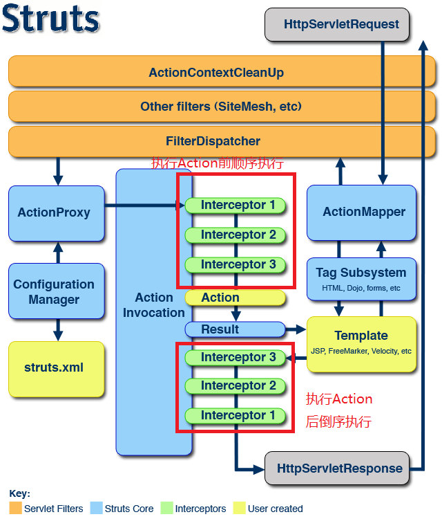
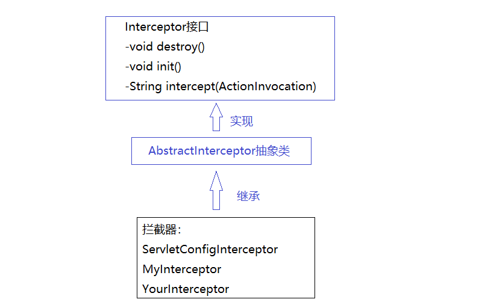

## 一、struts2拦截器介绍

struts2的许多功能都是建立在拦截器之上的，比如国际化、转换器、校验等功能。拦截器是动态拦截Action调用的对象，它提供了一种可以使开发者定义在一个Action执行前后执行的代码，也可以在Action执行前阻止其执行。拦截器栈（Interceptor stack），或者说拦截器链（Interceptor China）就是将拦截器按一定的顺序联结成一条链。在访问被拦截的方法或字段时，拦截器链中的拦截器就会按其之前定义的顺序被调用。

struts2的默认拦截器在配置文件 `struts-default.xml`中配置。拦截器是AOP编程思想的一种应用的形式。

当请求到达Struts 2的ServletDispatcher时，Struts 2会查找配置文件，并根据其配置实例化相对的拦截器对象，然后串成一个列表（list），最后一个一个地调用列表中的拦截器。拦截器链在执行Action前顺序执行，执行Action后倒序执行。



拦截器`Interceptor`的类的继承、实现结构:



## 二、自定义拦截器

1. 写一个类继承 `AbstractInterceptor`类，复写方法 `intercept`，参数 `ActionInvocation`对象调用方法 `invoke`表示放行，`invoke`方法返回值是字符串 `"success"`。

   ```java
   public class MyInterceptor extends AbstractInterceptor {
       @Override
       public String intercept(ActionInvocation actionInvocation) throws Exception {
           System.out.println("拦截之前前前");
           // 放行
           String returnStr = actionInvocation.invoke();
           System.out.println("拦截之后后后");
           return returnStr;
       }
   }
   ```

2. 在 `struts.xml`为Action配置一个拦截器

   ```xml
   <package name="interceptor_p" extends="struts-default">
       <interceptors>
           <interceptor name="interceptor" class="cn.zhuobo.web.interceptor.MyInterceptor" />
       </interceptors>
       
       <action name="hello" class="cn.zhuobo.web.action.HelloAction" method="sayHello">
           <!-- 拦截器的引用，name是上面配置的拦截器 -->
           <interceptor-ref name="interceptor"></interceptor-ref>
           <result name="success">/hello.jsp</result>
       </action>
   </package>
   ```

**注意:**

1. 如果在`struts.xml`中的 `action`标签中配置了拦截器的引用，那么默认的拦截器就失效了，也就是之前使用的参数注入等拦截器失效了。

2. 拦截器的执行顺序，假设有两个拦截器，如下：

   MyInterceptor1：

   ```java
   sout("拦截器11前前");
   invoke();
   sout("拦截器11后后");
   ```

   MyInterceptor2：

   ```java
   sout("拦截器22前前");
   invoke();
   sout("拦截器22后后");
   ```

   打印结果：

   ```http
   拦截器11前前
   拦截器22前前
   Action执行
   拦截器22后后
   拦截器11后后
   ```

   事实上 `invoke`方法的调用代表两种含义：

   1. 一是如果拦截器栈中还有其他的拦截器，那么 `ActionInvocation.invoke()` 将调用栈中的下一个拦截器来执行；
   2. 二是如果拦截器栈中没有其他拦截器了，那么 `ActionInvocation.invoke()` 将调用Action来执行。

   在这种情况下，如果不是调用`invoke`方法，而是直接返回一个其他的什么字符串，就会导致整个执行的过程被终止；这种以 `ActionInvocation.invoke()` 为界的机制，事实上可以将拦截器中的代码分为两个部分，**在invoke方法之前的代码将会在Action之前执行，invoke方法之后的代码将会在Action执行之后逆序执行**。


## 三、拦截器的一个应用实例：登录验证

实现的功能：用户必须提供指定的用户名密码登录才可以访问到非登录页面的内容，如果直接访问非登录页面会直接跳转到登录页面。

### 1. 页面代码

逻辑：

1. 用户在登录页面，填写数据提交到UserAction的login方法，login方法判断是否为指定的用户名密码，如果是，就跳转到main.jsp，否则跳转到login.jsp；
2. 在main.jsp提供连个连接，分别是学生列表、老师列表，点击分别跳转到学生列表、老师列表页面；
3. 如果没有登录，直接访问学生列表，老师列表会不被允许，直接跳转到login.jsp

**login.jsp**

```html
<body>
登录
<form action="${pageContext.request.contextPath}/login">
    用户名：<input name="username" type="text">
    密  码：<input name="password" type="text">
    <input value="登录" type="submit">
</form>
</body>
```

**main.jsp**

```html
主页
<ul>
    <li><a href="${pageContext.request.contextPath}/student/list">学生列表</a></li>
    <li><a href="${pageContext.request.contextPath}/teacher/list">老师列表</a></li>
</ul>
</body>
```

**studentList.jsp**

```html
学生列表
<ul>
    <li>孙无用</li>
    <li>李无极</li>
</ul>
```

**teacherList.jsp**

```html
<body>
老师列表
<ul>
    <li>王老师</li>
    <li>朱老师</li>
</ul>
</body>
```

### 2. 拦截器、struts.xml配置

UserAction.java

```java
public class UserAction extends ActionSupport implements ModelDriven<User> {
    private User user = new User();

    public String login() {
        if ("zhuobo".equals(user.getUsername()) && "abc".equals(user.getPassword())) {
            // 登录，将user存储到session
            HttpSession session = ServletActionContext.getRequest().getSession();
            session.setAttribute("user", user);
            return SUCCESS;
        }
        // 如果没有登录，跳转到toLoginPage的一个结果视图，这是一个全局的结果视图
        return "toLoginPage";
    }
    
    @Override
    public User getModel() {
        return user;
    }
}
```

CheckLoginInterceptor.java

这个拦截器是关键，该拦截器的逻辑是，从session中查询是否有user，如果没有user就说明没有登录，直接跳转到一个toLoginPage的全局的结果视图（该视图与Action无关，谁都可以跳转到，不和Action绑定）。

```java
public class CheckLoingInterceptor extends AbstractInterceptor{

    @Override
    public String intercept(ActionInvocation actionInvocation) throws Exception {
        // 判断是否登录
        HttpSession session = ServletActionContext.getRequest().getSession();
        User user = (User) session.getAttribute("user");
        if (user != null) {
            return actionInvocation.invoke();
        }

        return "toLoginPage";

    }
}
```

struts.xml

配置的逻辑：用户的任何请求，除了login之外，都应该被CheckLoginInterceptor所拦截，判断是否已经登录

```xml
<struts>
    <!--这个一个抽象的包，用来给后面的包继承，在包里定义的判断是否登录的拦截器、默认的拦截器（参数注入等功能）-->
    <package name="p1" extends="struts-default" abstract="true">
        <interceptors>
            <!--判断登录的拦截器-->
            <interceptor name="interceptor" class="cn.zhuobo.web.interceptor.CheckLoingInterceptor" />

            <!--一个拦截器分组，包括了自定义的拦截器，默认拦截器-->
            <interceptor-stack name="myDefaultStack">
                <interceptor-ref name="defaultStack" />
                <interceptor-ref name="interceptor" />
            </interceptor-stack>

        </interceptors>

        <!--全局的结果视图，该视图和Action无关，不和Action绑定-->
        <global-results>
            <result name="toLoginPage">/login.jsp</result>
        </global-results>

    </package>

    <!--登录login-->
    <package name="p2" extends="p1">
        <action name="login" class="cn.zhuobo.web.action.UserAction" method="login">
            <!--这个是登录，不需要拦截，由于有了自定义的拦截器（默认拦截器失效），因此要指定默认拦截器，登录不需要校验是否登录-->
            <interceptor-ref name="defaultStack"></interceptor-ref>
            <result name="success">/WEB-INF/main.jsp</result>
        </action>
    </package>

    <!--查看学生列表-->
    <package name="p3" extends="p1" namespace="/student">
        <action name="list" class="cn.zhuobo.web.action.StudentAction" method="list">
            <!--这里要判短是否登录，配置自定义拦截器分组，包括校验登录拦截器、默认拦截器-->
            <interceptor-ref name="myDefaultStack"></interceptor-ref>
            <result name="success">/WEB-INF/studentList.jsp</result>
        </action>
    </package>

    <!--查看老师列表-->
    <package name="p4" extends="p1" namespace="/teacher">
        <action name="list" class="cn.zhuobo.web.action.TeacherAction" method="list">
            <!--这里要判短是否登录，配置自定义拦截器分组，包括校验登录拦截器、默认拦截器-->
            <interceptor-ref name="myDefaultStack"></interceptor-ref>
            <result name="success">/WEB-INF/teacherList.jsp</result>
        </action>
    </package>
</struts>
```