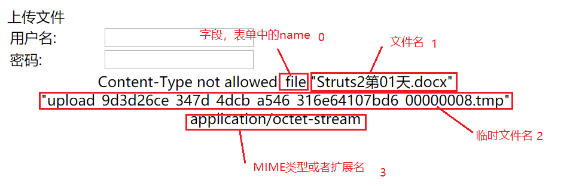
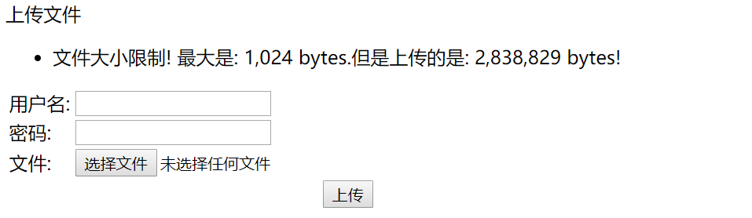
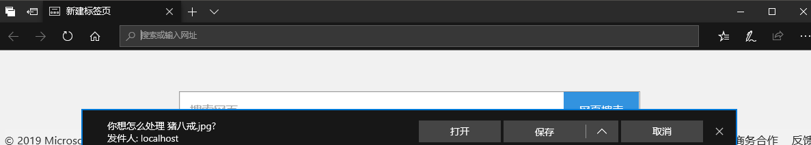

## 一、文件上传

1. struts提供的标签`<s:file>`支持文件的上传，该标签叫文件选择域；
2. 这个标签和HTML标签`<input file>`的作用是一样的；
3. 文件上传有两个前提条件：
   1. 表单的请求方式为`POST`；
   2. enctype类型必须为`multipart/form-data`;

## 二、简单的文件上传

1. upload.jsp

   ```html
   <body>
       上传文件
   <s:form action="/upload" method="POST" enctype="multipart/form-data">
       <s:textfield name="username" label="用户名" />
       <s:textfield name="password" label="密码" />
       <s:file name="file" label="文件" />
       <s:submit value="上传" />
   </s:form>
   </body>
   ```

2. UploadAction.java 

   ```java
   public class UploadAction extends ActionSupport {
       private String username;
       private String password;
       private File file; // 临时文件
       private String fileContentType;// 文件的类型,固定的写法
       private String fileFileName; // 文件名,固定的写法
   
   	// 5个属性全部写上setter方法，为了可以自动注入参数
       public String upload() {
           System.out.println(username);
           System.out.println(password);
           System.out.println(file);
           System.out.println(fileFileName);
           System.out.println(fileContentType);
   
           // 1. 保存文件的目录
           String dir = ServletActionContext.getServletContext().getRealPath("/WEB-INF/upload") + "\\" + username;
           System.out.println("保存文件的目录：" + dir);
           File f = new File(dir);
           if (!f.exists()) {
               f.mkdirs();
           }
   
           // 2. 保存路径 + 文件名
           String fileSavePath = dir + "\\" + fileFileName;
   
           // 3. 文件剪切到指定的目录
           file.renameTo(new File(fileSavePath));
   
           return SUCCESS;
   
       }
   }
   ```

3. struts.xml

   ```xml
   <package name="p1" extends="struts-default">
       <action name="upload" class="cn.zhuobo.web.action.UploadAction" method="upload">
           <!--上传失败，回到upload.jsp-->
           <result name="input">/upload.jsp</result>
           <!--上传成功，转发到success.jsp-->
           <result name="success">/success.jsp</result>
       </action>
   </package>
   ```


## 三、文件上传的配置

### 1. 文件的大小

struts在默认情况下只能上传大小不超过`2MB`的文件，而且如果上传的文件大小超过`2MB`，便会报错，要求提供name为**input**的回显结果。对文件类型的限制都是在一个文件上传拦截器`FileUploadInterceptor`中实现的。

在struts.xml修改文件上传大小的限制，配置一个常量，修改default.properties的值:

```xml
<!--限制文件上传的大小为10M-->
<constant name="struts.multipart.maxSize" value="10240000" />
```

### 2. 文件的类型

通过拦截器限制文件上传的MIME类型、或者文件的扩展名。

配置默认拦截器组`defaultStack`中的fileUpload拦截器，有两种方式，一是配置允许的文件MIME类型，而是配置允许的文件扩展名。

```xml
<package name="p1" extends="struts-default">
        <action name="upload" class="cn.zhuobo.web.action.UploadAction" method="upload">
            
            <!--默认拦截器，默认拦截器是一组拦截器-->
            <interceptor-ref name="defaultStack">
                
				<!--<param name="fileUpload.allowedExtensions">jpg,png</param>-->
                <param name="fileUpload.allowedTypes">image/jpeg,image/png,image/bmp</param>
            </interceptor-ref>
            
            <!--上传失败，回到upload.jsp-->
            <result name="input">/upload.jsp</result>
            <!--上传成功，转发到success.jsp-->
            <result name="success">/success.jsp</result>
        </action>
    </package>
```

### 3. 修改错误信息为中文

struts对于不符合要求的文件会有错误信息，但是是英文显示的，现在希望可以友好地展示错误信息。



1. 在src下出创建一个国际化的资源包，名为`fileUploadMessage.properties`,文件内容为：

   ```properties
   struts.messages.error.uploading=Error uploading: {0}
   struts.messages.error.file.too.large={1}: 文件大小超过10M
   struts.messages.error.content.type.not.allowed={1}：文件的类型不被允许-{3}
   struts.messages.error.file.extension.not.allowed={1}：文件的扩展名不被允许-{3}
   struts.messages.upload.error.SizeLimitExceededException=文件大小限制! 最大是: {0} bytes.但是上传的是: {1} bytes!
   ```

2. 在struts.xml中指定国际化资源包

   ```xml
   <constant name="struts.custom.i18n.resources" value="fileUploadMessage" />
   ```



## 四、多文件的上传

要上传多个文件，关键点在于可以接收处理多个文件，因此Action中将接收的文件字段改为数组，遍历处理文件数组即可。

upload.jsp

```jsp
<body>
    上传文件
    <s:actionerror />
    <s:form action="/upload" method="POST" enctype="multipart/form-data">
        <s:textfield name="username" label="用户名" />
        <s:textfield name="password" label="密码" />
        <s:file name="files" label="文件" />
        <s:file name="files" label="文件" />
        <s:file name="files" label="文件" />
        <s:submit value="上传" />
    </s:form>
</body>
```

UploadAction.java

```java
public class UploadAction extends ActionSupport {
    private String username;
    private String password;
    private File[] files;
    private String[] filesContentType;
    private String[] filesFileName;

	// 这里省略了属性的setter方法...
    //文件上传
    public String upload() {

        // 1. 保存的目录
        String dir = ServletActionContext.getServletContext().getRealPath("/WEB-INF/upload") + "\\" + username;
        System.out.println("保存文件的路径：" + dir);
        File f = new File(dir);
        if (!f.exists()) {
            f.mkdirs();
        }
        // 2. 遍历文件的数组
        for (int i = 0; i < files.length; i++) {
            File file = files[i];
            String fileName = filesFileName[i];
            String fileType = filesContentType[i];

            System.out.println(fileName + ":" + fileType);

            // 3. 保存文件的路径
            String saveFilePath = dir + "\\" + fileName;

            // 4. 剪切文件到改路径
            file.renameTo(new File(saveFilePath));

        }
        return SUCCESS;
    }
}
```


## 五、文件的下载

DownloadAction.java

1. Action提供一个属性`InputStream`;

2. Action提供为属性 `Inputstream`提供一个getter方法;

3. 为属性 `InputStream` 赋值;

   ```java
   public class DownloadAction extends ActionSupport {
       private InputStream inputStream;
       private String filename;
   
       public String getFilename() {
           return filename;
       }
   
       public InputStream getInputStream() {
           return inputStream;
       }
   
       public String download() throws FileNotFoundException, UnsupportedEncodingException {
   
           filename = "1.jpg";
   
           String path = "C:\\Users\\zhuobo\\Pictures\\" + filename;
           // 给inputStream赋值
           inputStream = new FileInputStream(path);
   
           // 指定被下载的文件命名为 猪八戒.jpg
           filename = "猪八戒.jpg";
           // 有中文名，使用utf-8编码
           filename = URLEncoder.encode(filename, "utf-8");
   
           System.out.println(filename);
   
           return SUCCESS;
       }
   }
   ```

   

struts.xml

1. 配置一个结果视图，type为`stream`

2. 为结果视图配置参数

3. 指定输入流、文件名

   ```xml
   <action name="download" class="cn.zhuobo.web.action.DownloadAction" method="download">
       <result type="stream" name="success">
       	<!--表示读取的是getInputStream方法 -->
           <param name="inputStream">inputstream</param>
           
           <!--${filename}表示读取的是getFileName方法,也就是指定的被下载的文件的命名-->
           <param name="contentDisposition">attachment;filename=${filename}</param>
           
           <param name="contentType">application/octet-stream</param>
       </result>
   </action>
   ```



