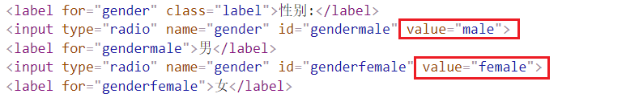

## 一、OGNL介绍

OGNL是Object Graphic Navigation Language（对象图导航语言）的缩写，是一个单独的开源项目。Struts2框架使用OGNL作为默认的表达式语言，作用类似于EL表达式，可以从作用域中获取值；Struts2框架中想要使用OGNL表单时就必须使用**struts2标签库**。


## 二、OGNL的功能

### 1. 访问对象的方法

比如字符串对象的方法

```jsp
<s:property value="'david'.length()" /><br>
```

### 2. 访问静态属性

struts2默认是不允许OGNL访问类的静态属性和静态方法的，在 `default.properties`中可以看到 `struts.ognl.allowStaticMethodAccess=false`，因此要访问类的静态属性和静态方法要在 `struts.xml`配置为true

```XML
<constant name="struts.ognl.allowStaticMethodAccess" value="true" />
```

访问静态属性的格式是 `@类名@方法`：

```html
int的最大值<s:property value="@java.lang.Integer@MAX_VALUE" /> <br>
  随机数<s:property value="@java.lang.Math@abs(-3)" /> <br>
```


### 3. 封装list数据

```html
<s:radio list="{'男', '女'}" name="gender" label="性别" />
```

解析为HTML，将list的值作为`value`：

### 4. 封装map数据

```html
<s:radio list="#{'male':'男','female':'女'}" label="性别" name="gender" />
```

解析为HTML，将map的`key`作为`value`

### 5 .在struts.xml中使用OGNL

可以中struts.xml中使用OGNL获取Action的值，比如在Action中有个属性，并且该属性提供了getter方法，可以使用OGNL去获取该属性的值。在[struts的文件下载](http://zhuobo.top/2019/06/05/struts2%E6%96%87%E4%BB%B6%E4%B8%8A%E4%BC%A0/)中，为了下载的文件中文名可以不乱码，在Action的方法中使用`URLEncoder`类的静态方法`encode`给中文名的文件名编码，并且在`struts.xml`中通过 `<param name="contentDisposition">attachment;filename=${filename}</param>`的方法获取文件名。现在通过OGNL表达式不用在Action中使用URLEncoder的方法编码，在struts.xml中也可实现。

```xml
<action name="download" class="cn.zhuobo.web.action.DownloadAction" method="download">
    <result type="stream" name="success">
        <param name="inputStream">inputstream</param>
        <param name="contentDisposition">attachment;filename=${@java.net.URLEncoder@encode(filename, "utf-8")}</param>
        <param name="contentType">application/octet-stream</param>
    </result>
</action>
```