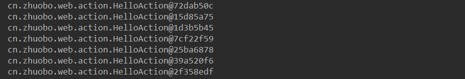
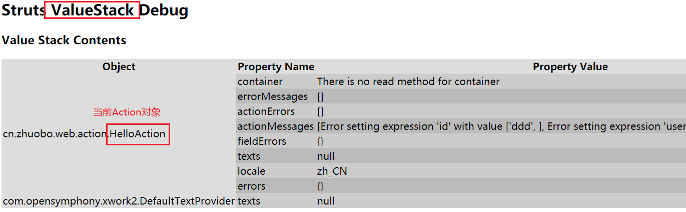
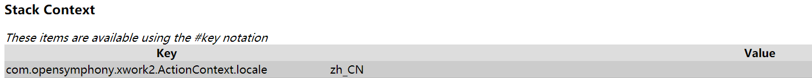
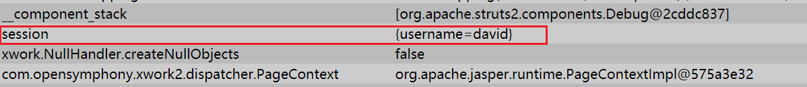
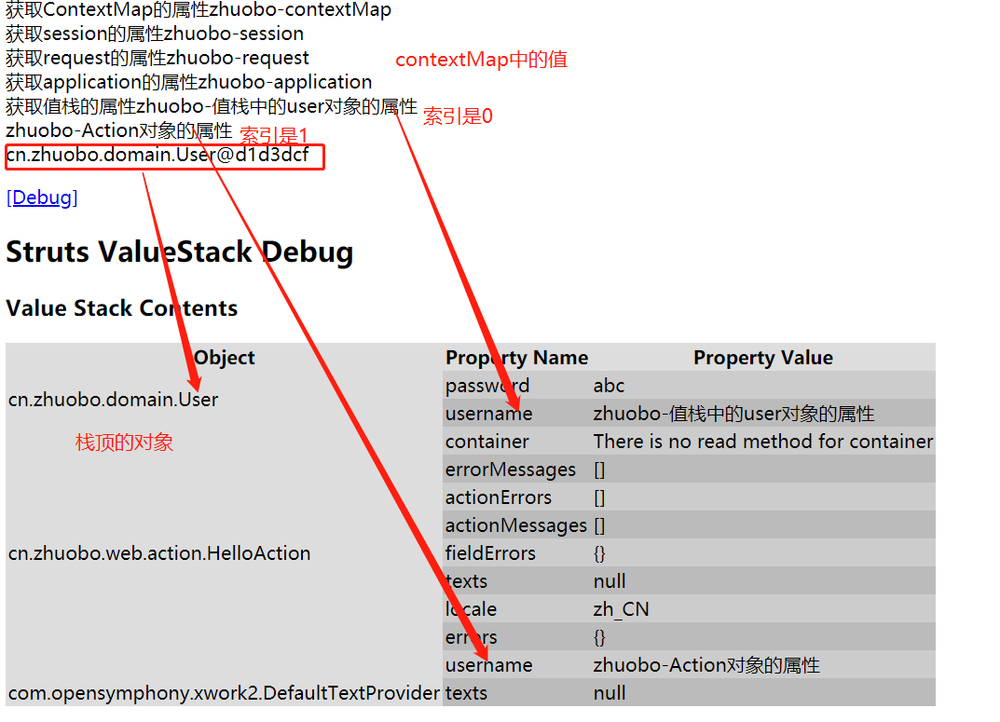
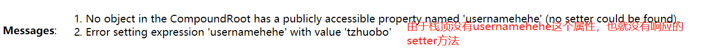
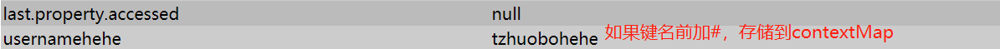
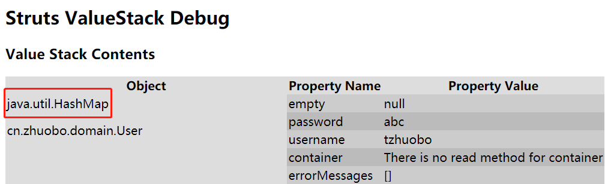

##  

## 一、Action的生命周期

### 1. Action是多例的

struts2的Action的多实例的，也就是每次被访问都会创建一个实例（也就是为每个请求都创建一个实例），因此不会出现线程安全问题。与之对比的是Servlet和struts1的Action都是单实例的，当有不同的请求同时访问，可能会出现线程安全问题。为了验证struts2为每次请求都创建一个Action的实例，下面创建一个Action，访问并在方法中打印**this**（this值得就是这个Action对象本身）。

```java
public class HelloAction extends ActionSupport {
    public String sayHello() {
        System.out.println(this);
        return SUCCESS;
    }
}
```

输出：



这个在一个浏览器中刷新几次访问HelloAction得到的结果，由于this表示的就是Action对象本身，从输出结果可以知道这些对象是不同的对象，因此struts2的Action每次被访问都会实例化。

### 2. Servlet是单例的

与struts2的Action不同，Servlet是默认情况下单例的。当有多个请求请求同一个Servlet的时候，Servlet采用多线程的方式处理多个请求。多线程依赖线程池实现，Servlet使用一个**调度线程**管理多个处理请求的线程。当有一个请求到来，调度线程为这个请求分配一个处理请求的线程，然后由该线程执行Servlet的**service**方法。因此，当有多个请求到达服务器，就会出现**service**方法在多个线程之间并发执行的情况。这种单实例多线程的机制有利于减少创建实例带来的开销，提升了对请求的响应时间，但是有可能会出现线程安全问题。

与此类似的，**struts1**的Action也是单例的。

**线程安全问题的避免**：

1. 同步对共享数据的访问：在`doGet()`，`doPost()`方法前加上关键字 `synchronized`，可以保证一次（同时）只能有一个线程在访问共享区域；
2. 避免使用Servlet的成员变量，使用局部变量，哪怕不得已使用了成员变量，也不要改变成员变量的值，获取它即可。


## 二、请求数据的存储

每次向服务器发起请求都会携带一些请求的数据，那么服务器是如何存储这些请求的数据的呢？当服务器接收到请求，在执行Action之前核心控制器 `StrutsPrepareAndExecuteFilter` 都会创建一个`ActionContext`和一个`ValueStack`用于存储数据，这两个对象存储了整个访问过程的数据。

`ValueStack`对象是一个List对象，封装了当前被访问的Action的对象以及其他的相关的对象；

`ActionContext`对象，也就是`contextMap`对象，是一个Map对象，存储的数据包括：

| **Key**           | **Value**                    | **说明**                                           |
| ----------------- | ---------------------------- | -------------------------------------------------- |
| valueStack (root) | java.util.List               | 没有root这个key，值栈是是一个list。                |
| application       | java.util.Map<String,Object> | ServletContext中的所有属性。                       |
| session           | java.util.Map<String,Object> | HttpSession中的所有属性。                          |
| request           | java.util.Map<String,Object> | ServletRequest中的所有属性。                       |
| parameters        | java.util.Map                | 参数                                               |
| attr              | java.util.Map                | 把页面、请求、会话、应用范围内的所有属性放到一起。 |

可以使用`<s:debug>`标签查看`ActionContext`存储的数据。





由上面的表格可以知道session也是保存在contextMap中的，因此我们可以测试一下，先往session中存储一个键值对：

```html
<body>
  <%session.setAttribute("username","david");%>
  <s:debug></s:debug>
</body>
```



## 三、ActionContext的数据操作

### 1. ActionContext（contextMap）中存储数据

```java
public class HelloAction extends ActionSupport {

    public String sayHello() {
        System.out.println(this);
        
        // 1. 获取ActionContext
        ActionContext contextMap = ActionContext.getContext();
        // 2. 往ActionContext中存储数据（键值对）
        contextMap.put("username","zhuobo");
        contextMap.put("password", "abc");

        // 3. 往ActionContext中的session中存储数据
        Map<String, Object> session = contextMap.getSession();
        session.put("username", "zhuobo11");
        session.put("password", "abc11");

        // 4. 往ActionContext中的request中存储数据
        Map<String, Object> application = contextMap.getApplication();
        //session对象也可以用这种方法获取
        /*HttpSession session1 = ServletActionContext.getRequest().getSession();*/

        application.put("username", "zhuobo22");
        application.put("password", "abc22");

        // 5. 往request中存储数据
        HttpServletRequest request = ServletActionContext.getRequest();
        request.setAttribute("username","zhuobo33");
        request.setAttribute("password", "abc33");
        
        return SUCCESS;
    }
}
```

### 2. ValueStack中存储数据

`ValueStack`是存储在`request`域中，也存储在`ActionContext`的，因此可以有**3**种方式获取`ValueStack`。一是通过`ActionContext`获取，二是通过`Request`获取，而获取 `Request`又有两种方式。在这三种方式中，第一种最常用，因为比较简便。

```java
// 获取ValueStack的三种方式,但是由于每次访问都是仅仅创建一个ActionContext和ValueStack，
// 因此三种方法获取的都是同一个ValueStack

// 1.通过ActionContext获取
ValueStack valueStack1 = ActionContext.getContext().getValueStack();

// 2.先获取Request，再通过request获取ValueStack
Map<String, Object> request = (Map<String, Object>) ActionContext.getContext().get("request");
ValueStack valueStack2 = (ValueStack) request.get("struts.valueStack");

// 3. 先获取Request对象，再获取ValueStack
ValueStack valueStack3 = (ValueStack) ServletActionContext.getRequest().getAttribute("struts.valueStack");


// 向ValueStack中存储数据（对象）
valueStack1.push(new User("zhuobo","abc "));

System.out.println(valueStack1);
System.out.println(valueStack2);
System.out.println(valueStack3);
```

三种不同方式获取的值栈是同一个值栈：


使用`ValueStack`的`push`方法往 `ValueStack`中存储数据。


### 3. 获取数据

在jsp页面，通过struts的 `<s:property value="">`获取，双引号里写的是OGNL。其中如果是存储在contextMap中的属性，获取的时候加#，存储在ValueStack中的直接写key。当有多个同名的属性都存储在ValueStack中时，可以使用索引来获取，`[i].xxx`表示获取低**i**个xxx属性的值。特殊的当获取值栈的属性，而没有写value值的时候，比如 `<s:property />`表示获取值栈栈顶的对象。

```jsp
<%--获取contextMap的属性，需要加#--%>
获取ContextMap的属性<s:property value="#username" /> <br>
获取session的属性<s:property value="#session.username" /> <br>
获取request的属性<s:property value="#request.username" /> <br>
获取application的属性<s:property value="#application.username" /> <br>

<%--获取值栈的属性--%>
获取值栈的属性<s:property value="[0].username"/><br>
<s:property value="[1].username"/><br>
<s:property />

<s:debug></s:debug> <br>
```




### 4. ValueStack的方法

1. push()：往值栈的栈顶中压入数据

   ```java
   // 向ValueStack中存储数据（对象）
   valueStack1.push(new User("zhuobo-值栈中的user对象的属性","abc"));
   ```

2. setValue(String，Object)：更改栈顶的值

   ```java
   
   // 更改栈顶的username为tzhuobo
   valueStack1.setValue("username","tzhuobo");
   
   // 如果栈顶没有usernamehehe属性，或者没有提供setter方法，就会报错
   valueStack1.setValue("usernamehehe", "tzhuobo");
   
   // 如果键名前面加了#，表明向contextMap中存储值
   valueStack1.setValue("#usernamehehe", "tzhuobohehe");
   ```

   没有提供setter方法，报错信息：

   

   如果键名前面加了#，表明向contextMap中存储值：

   

3. set()：把数据存储到一个**Map**中，然后将Map压如值栈

   ```java
   // set方法，将数据存储进一个map，然后将map压入值栈
   valueStack1.set("user", new User("david","123"));
   ```

   

   获取map中的值：

   ```jsp
   <%--存储的键名是user,点运算符得到user的username--%>
   <s:property value="user.username"/>
   <s:property value="user.password"/>
   ```