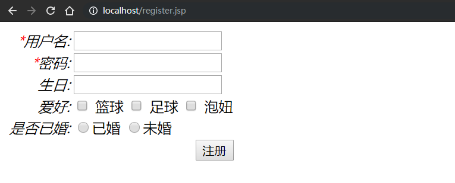
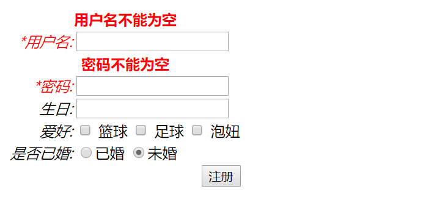
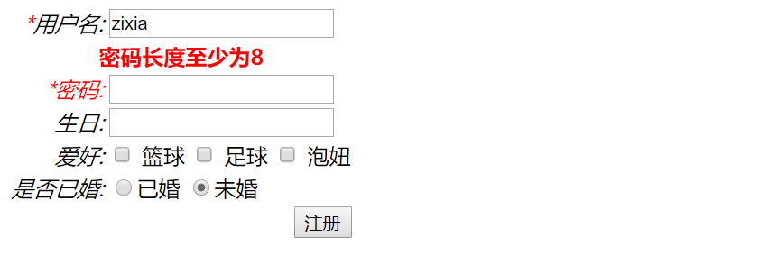

## 一、struts的表单标签

1. 在jsp页面引入struts标签

   ```html
   <%@ taglib uri="/struts-tags" prefix="s"%>
   ```

2. 使用form标签

   ```html
   <html>
   <head>
       <title>register</title>
       <s:head></s:head>
   </head>
   <body>
       <s:form action="user/register.do">
           <s:textfield name="username" label="用户名" requiredLabel="true" requiredPosition="left"></s:textfield>
           <s:password name="password" label="密码" requiredLabel="true" requiredPosition="left"></s:password>
           <s:textfield name="birthday" label="生日"></s:textfield>
           <s:checkboxlist list="#{'篮球':'篮球','足球':'足球','泡妞':'泡妞'}" name="hobby" label="爱好"></s:checkboxlist>
           <s:radio list="#{'true':'已婚', 'false':'未婚'}" name="married" label="是否已婚"></s:radio>
           <s:submit value="注册"></s:submit>
       </s:form>
       <br>
   </body>
   </html>
   ```

   显示效果如下：

   
   
   **struts表单的优点：**
   
   1. 自带了一定了样式，比如对齐
   2. 方便标记字段是否为必须填写
   3. 方便数据的回显
   4. 方便显示校验的信息


## 二、struts的表单在Action校验

1. 在提交表单的Action（继承了ActionSupport类）的覆盖重写方法`validate`,这是一个全局的方法,也就是在该Action里的任何方法要执行，就要首先执行这个 `validate`方法。

   ```java
   @Override
   public void validate() {
       if (StringUtils.isEmpty(user.getUsername())) {
           addFieldError("username", "用户名不能为空");
       }
   	// 相当于if(user.getPassword() == null || "".equals(user.getPassword()))
   	// 这个工具类封装了这一行代码......
       if (StringUtils.isEmpty(user.getPassword())) {
           addFieldError("password", "密码不能为空");
       }
   }
   ```
   

由于`validate`方法是一个全局的方法，因此Action里所有的方法执行之前都会先执行该方法，但是如果是这样又有着明显的不合理，总能不能什么方法都要执行校验用户名、密码的逻辑。因此可以在不需要执行`validate`方法的方法上加上注解`@SkipValidation`，表示该方法跳过跳过`validate`方法的验证。

```java
@SkipValidation
public String list() {
    return "list";
}
```


   如果输入用户名密码为空，就会提示：

   


2. 此外还可以为每个方法写一个验证的方法，这种就是局部的验证方法，方法命名为 `validate`方法名(方法名首字符大写)，如有一个list方法，那么就写一个`validateList`方法专门验证`list`方法

   ```java
   // 专门验证register方法的validate方法
      public void validateRegister() {
          if (StringUtils.isEmpty(user.getUsername())) {
              addFieldError("username", "用户名不能为空");
          }
   
          if (StringUtils.isEmpty(user.getPassword())) {
              addFieldError("password", "密码不能为空");
          }
      }
      public String register() {
          System.out.println(user);
   
          //调用service注册
          userService.register(user);
          
          return NONE;
      }
   ```

## 三、xml配置校验

在action里为某个Action类写一个配置文件，表示该Action的所有方法都要进行校验，如Action的名为`UserAction`，则xml的命名为`UserAction-validation.xml`，该文件的配置为

```xml
<?xml version="1.0" encoding="UTF-8"?>
<!-- 该dtd在xwork-core-2.3.37.jar-->
<!DOCTYPE validators PUBLIC
        "-//Apache Struts//XWork Validator 1.0.3//EN"
        "http://struts.apache.org/dtds/xwork-validator-1.0.3.dtd">

<validators>
    <validator type="requiredstring">
        <param name="fieldName">username</param>
        <message>用户名不能为空-xml</message>
    </validator>
</validators>
```

这种方式的配置也是全局的配置，默认Action的每个方法都要执行校验，同时，如果有某些方法不希望执行校验在方法上加上注解 `@SkipValidation`即可跳过校验。

当然，也可以为类的某个方法指定校验，这时候xml文件的命名改为 `Action类名-方法名-validation.xml`，比如可以命名为 `UserAction-register-validation.xml`。

```xml
<validators>
    <!--用户名不能为空-->
    <validator type="requiredstring">
        <param name="fieldName">username</param>
        <message>用户名不能为空-xml</message>
    </validator>

    <!-- 密码长度至少为8 -->
    <validator type="stringlength">
        <param name="fieldName">password</param>
        <param name="minLength">8</param>
        <message>密码长度至少为8</message>
    </validator>
</validators>
```



## 四、采用xml校验

一般来说会采用xml的方式校验表单，以减少Action中的代码量。这里是xml校验的几个例子：

```xml
<validators>
    <!--username-->
    <validator type="requiredstring">
        <param name="fieldName">username</param>
        <message>用户名不能为空</message>
    </validator>
    
    <!--age-->
    <validator type="int">
        <param name="fieldName">age</param>
        <param name="max">100</param>
        <param name="min">10</param>
        <message>年龄必须是10~100</message>
    </validator>
    
    <!--email使用两种校验，一是不能为空，而是如果填写了就校验格式-->
    <!--1. 邮箱不能为空-->
    <validator type="requiredstring">
        <param name="fieldName">email</param>
        <message>邮箱不能为空</message>
    </validator>
    <!-- 2. 邮箱格式 -->
    <validator type="email">
        <param name="fieldName">email</param>
        <message>邮箱格式不正确</message>
    </validator>

    <!-- password-->
    <validator type="requiredstring">
        <param name="fieldName">password</param>
        <message>邮箱不能为空</message>
    </validator>
    <validator type="stringlength">
        <param name="fieldName">password</param>
        <param name="minLength">8</param>
        <param name="maxLength">18</param>
        <message>密码长度为8~18</message>
    </validator>
    
    <!--确认密码 要和password一致-->
    <validator type="expression">
        <param name="expression">
            <![CDATA[password == repassword]]>
        </param>
        <message>密码不一致</message>
    </validator>

    <validator type="url">
        <param name="fieldName">url</param>
        <message>url不合法，以http://开头</message>
    </validator>

    <validator type="required">
        <param name="fieldName">gender</param>
        <message>性别必须选择</message>
    </validator>

</validators>
```

