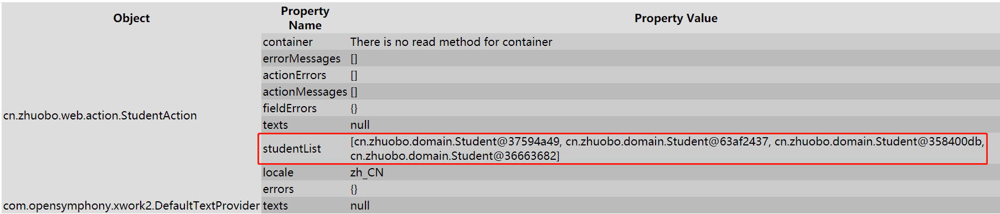
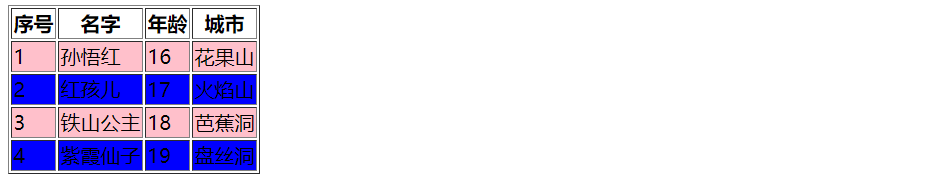
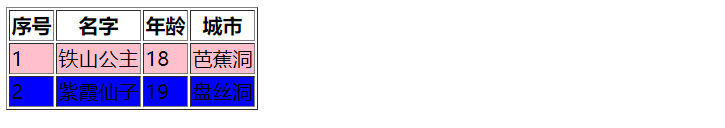
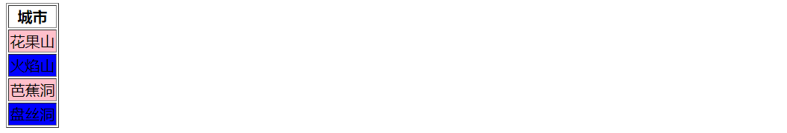

## 一、struts的标签

struts提供的简化视图页面编写的标签，要使用struts的标签，首先要引入：`<%@ taglib uri ="/struts-tags" prefix ="s" %>`。

## 二、常用标签

### 1. 迭代标签

当一个Action类提供了一个属性，并且提供了该属性的**getter**方法，那么该属性会自动被Struts2保存到**值栈**之中，也就是不用专门获取值栈在存储数据。

```java
public class StudentAction extends ActionSupport {
    private List<Student> studentList;

    // Action提供属性，并且提供属性的getter方法，那么属性就会被struts2自动存储到值栈
    // jsp从值栈中获取数据
    public List<Student> getStudentList() {
        return studentList;
    }

    public String list() {
        // 如果是使用了struts2，jsp一般从值栈中获取数据
        // 如果是使用了servlet，jsp一般从request域中获取数据
        studentList = new ArrayList<Student>();
        studentList.add(new Student("孙悟红", 16, "花果山"));
        studentList.add(new Student("红孩儿", 17, "火焰山"));
        studentList.add(new Student("铁山公主", 18, "芭蕉洞"));
        studentList.add(new Student("紫霞仙子", 19, "盘丝洞"));
        return SUCCESS;
    }
}
```



遍历标签的使用：

1. value：是OGNL表达式，首先从值栈中获取；
2. var：遍历使用的临时变量，值得注意的是Struts会把当前遍历到的变量以var为键，变量指向的对象为值存储到contextMap中，因此获取var的对象要从contextMap中获取；
3. status：用于记录变量的一些属性
   1. boolean isOdd()：奇数
   2. boolean iseven()：偶数
   3. boolean isFirst()：第一个
   4. boolean isLast()：最后一个
   5. int getIndex()：获取索引，从0开始
   6. int getCount()：获取序号，从1开始

```html
<%--studentList是存储在值栈中的，但是每遍历一次就会将student存储到contextMap中，因此OGNL获取要加#--%>
    <s:iterator value="studentList" var="student" status="st">
        <s:if test="#st.odd">
            <tr class="odd">
                <td>${st.count}</td>
                <td><s:property value="#student.name"/></td>
                <td><s:property value="#student.age"/></td>
                <td><s:property value="#student.city"/></td>
            </tr>
        </s:if>
        <s:if test="#st.even">
            <tr class="even">
                <td>${st.count}</td>
                <td><s:property value="#student.name"/></td>
                <td><s:property value="#student.age"/></td>
                <td><s:property value="#student.city"/></td>
            </tr>
        </s:if>
    </s:iterator>
```




### 2. OGNL投影

OGNL投影指的是根据给定条件过滤集合：

?#：过滤**所有**符合条件的元素，如studentList.{?#this.age > 17}

^#：过滤**第一个**符合条件的元素，如studentList.{^#this.age > 17}

$#：过滤**最后一个**符合条件的元素，如studentList.{$#this.age > 17}

```html
<s:iterator value="studentList.{?#this.age > 17}" var="student" status="st">
            <s:if test="#st.odd">
                <tr class="odd">
                    <td>${st.count}</td>
                    <td><s:property value="#student.name"/></td>
                    <td><s:property value="#student.age"/></td>
                    <td><s:property value="#student.city"/></td>
                </tr>
            </s:if>
            <s:if test="#st.even">
                <tr class="even">
                    <td>${st.count}</td>
                    <td><s:property value="#student.name"/></td>
                    <td><s:property value="#student.age"/></td>
                    <td><s:property value="#student.city"/></td>
                </tr>
            </s:if>
</s:iterator
```



如果是值需要展示指定的属性，比如只需要展示城市，遍历的时候不用指定`var`，这样默认遍历取出的值便是放在值栈栈顶，如`studentList.{city}`便是将该集合所有的`Student`的`city`属性存储到值栈栈顶，从栈顶取出值即可。

```html
<s:iterator value="studentList.{city}" status="st">
    <s:if test="#st.odd">
        <tr class="odd">
            <td><s:property/></td>
        </tr>
    </s:if>
    <s:if test="#st.even">
        <tr class="even">
        	<!-- 不写value,直接从值栈栈顶取值 -->
            <td><s:property/></td>
        </tr>
    </s:if>
</s:iterator>
```



### 3. set标签

`<s:set>`标签用于将数据存储到指定的位置，存储数据的位置包括application、session、request、page、action一共5个位置。`<s:set>`的属性：

1. value：必选，存储到map的值，是一个OGNL表达式；
2. var：可选，存储到map的键；
3. scope：可选，存储范围，不写默认是action，在**contextMap中和request中各存一份**；

```html
<s:set value="'zhuobo-action'" var="username"/>
<s:set value="'zhuobo-application'" var="username" scope="application"/>
<s:set value="'zhuobo-request'" var="username" scope="request"/>
<s:set value="'zhuobo-session'" var="username" scope="session"/>
<s:set value="'zhuobo-page'" var="username" scope="page"/>

<%--取数据--%>
<s:property value="#application.username"/><br>
<s:property value="#request.username"/><br>
<s:property value="#session.username"/><br>
<s:property value="#username"/><br>
```

### 4. action标签

action标签用于在jsp页面中调用Action，如果需要将Action的结果页面展示出来，设置属性 `executeResult`为 `true`，指定Action的name属性，但是不用写后缀名。

```html
<s:action name="hello" executeResult="true" />
```

