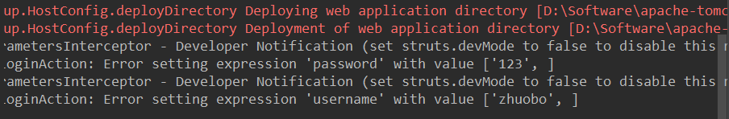

在使用struts2框架的过程中遇到的一些问题的总结：

### 1. 异常Error setting expression 'xxx' with value...

在提交表单的时候遇到的这个问题，其实并不影响应用的运行，但是也还是个异常，根据提示可以发现是 `Developer Notification`，也就是在struts.xml配置了开发模式，才会提醒这个信息，关闭开发模式便不会提醒。但是问题的根本应该是表单对应的参数，比如username和password在Action类里没有提供对应的setter和getter方法，在Action类中提供了便不会有这个异常的提示。

### 2. struts2的自动类型转换

Servlet接收到的表单提交的数据都是字符串String类型的，但是Struts2会自动进行类型转换，比如可以转为Date类型、boolean类型，如果是CheckBox则会使用`逗号,以及空格`将选择值拼接为字符串。这样便可以在定义模型（比如User）的时候，成员变量可以直接使用Date类型，boolean类型等，而CheckBox的值也可以不使用字符串数组`String[]`保存，使用字符串即可。

